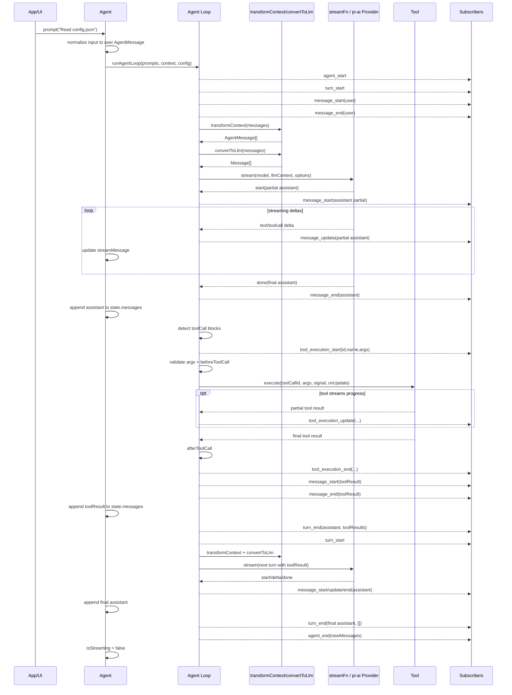
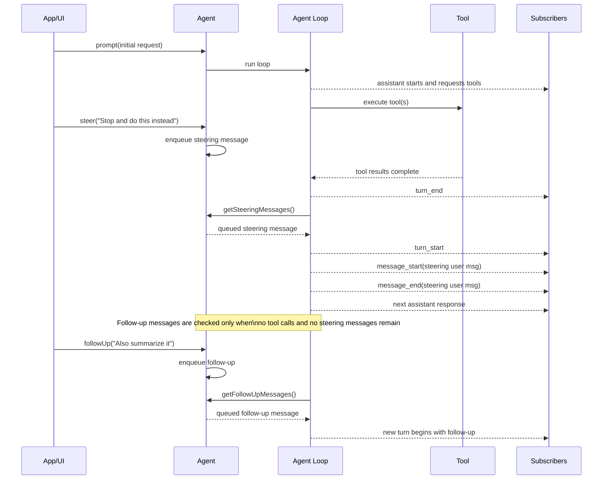
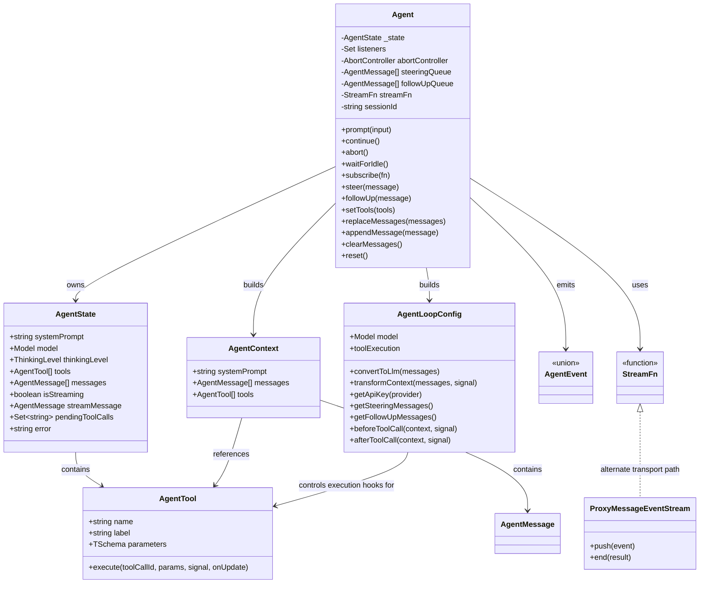
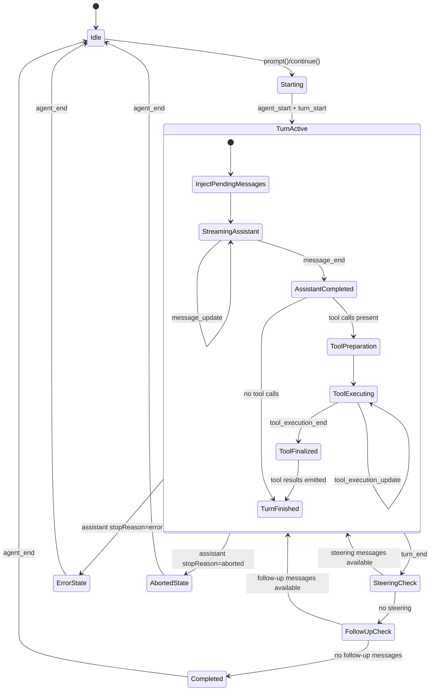

# pi-agent-core architecture design

This document describes how `packages/agent` (`@mariozechner/pi-agent-core`) works and how it is implemented.

Source basis:
- `packages/agent/src/agent.ts`
- `packages/agent/src/agent-loop.ts`
- `packages/agent/src/types.ts`
- `packages/agent/src/proxy.ts`

## 1. Purpose

`pi-agent-core` is a stateful orchestration runtime built on top of `@mariozechner/pi-ai`.

Its responsibilities are:
- hold agent state and conversation history
- convert app-level messages into LLM-compatible messages
- stream assistant output incrementally
- detect and execute tool calls
- feed tool results back into the model context
- emit lifecycle events for UI integration
- support steering and follow-up messages while or after the agent is running

The package has two main layers:
- **High-level API**: `Agent` class in `src/agent.ts`
- **Execution engine**: loop functions in `src/agent-loop.ts`

## 2. High-level architecture

### 2.1 Main components

#### `Agent` class
The `Agent` class is the stateful facade used by applications.

Responsibilities:
- owns `AgentState`
- exposes `prompt()`, `continue()`, `abort()`, `steer()`, `followUp()`
- manages event listeners
- manages steering and follow-up queues
- builds the `AgentContext` and `AgentLoopConfig`
- delegates execution to `runAgentLoop()` and `runAgentLoopContinue()`
- updates in-memory state from loop events

#### Agent loop runtime
The loop implementation in `src/agent-loop.ts` is the orchestration engine.

Responsibilities:
- emit agent and turn lifecycle events
- append prompt messages into context
- transform context before LLM calls
- convert internal messages into LLM-compatible messages
- stream assistant responses from the model
- detect tool calls in assistant output
- execute tools sequentially or in parallel
- emit tool lifecycle and tool result message events
- continue until there are no more tool calls, steering messages, or follow-up messages

#### Message adaptation boundary
Internally, the agent works with `AgentMessage[]`.

Before each model call:

```text
AgentMessage[] -> transformContext() -> convertToLlm() -> Message[]
```

This allows applications to keep custom message types in agent state while only sending LLM-compatible messages to providers.

#### Stream abstraction
The loop depends on a `StreamFn`.

Default implementation:
- `streamSimple` from `@mariozechner/pi-ai`

Optional implementation:
- `streamProxy` from `src/proxy.ts`

This separates orchestration logic from provider transport logic.

#### Tool execution subsystem
Tools are modeled as `AgentTool`, which extends the tool schema with an `execute()` method.

Tool pipeline:
- detect tool call blocks in assistant content
- find tool by name
- validate arguments
- run `beforeToolCall`
- execute tool
- emit progress updates
- run `afterToolCall`
- emit final `toolResult` message back into context

#### Event model
The package is event-driven.

Event groups:
- `agent_start`, `agent_end`
- `turn_start`, `turn_end`
- `message_start`, `message_update`, `message_end`
- `tool_execution_start`, `tool_execution_update`, `tool_execution_end`

This makes it suitable for TUI, web UI, logging, and orchestration layers.

## 3. Key data structures

### 3.1 `AgentState`
`AgentState` stores:
- `systemPrompt`
- `model`
- `thinkingLevel`
- `tools`
- `messages`
- `isStreaming`
- `streamMessage`
- `pendingToolCalls`
- `error`

### 3.2 `AgentContext`
`AgentContext` is the runtime context passed through the loop:
- `systemPrompt`
- `messages`
- `tools`

### 3.3 `AgentLoopConfig`
`AgentLoopConfig` contains orchestration behavior and integration hooks:
- `model`
- `convertToLlm`
- `transformContext`
- `getApiKey`
- `getSteeringMessages`
- `getFollowUpMessages`
- `toolExecution`
- `beforeToolCall`
- `afterToolCall`
- streaming options forwarded to `@mariozechner/pi-ai`

### 3.4 `AgentMessage`
`AgentMessage` is a union of:
- provider-compatible `Message`
- custom application message types added through declaration merging

## 4. Request lifecycle

### 4.1 `prompt()` path
1. application calls `agent.prompt(...)`
2. `Agent` normalizes the input into one or more `AgentMessage`s
3. `Agent` creates an `AbortController`
4. `Agent` snapshots current state into an `AgentContext`
5. `Agent` builds `AgentLoopConfig`
6. `Agent` invokes `runAgentLoop(...)`
7. loop emits events while processing
8. `Agent._processLoopEvent()` updates internal state
9. if tools are requested, tool execution is performed
10. loop continues until stable completion
11. `agent_end` is emitted and `Agent` clears runtime state

### 4.2 `continue()` path
`continue()` resumes processing from existing context without adding a new user prompt.

Constraint:
- the last message must not be an `assistant` message

It is used for retry or resuming after tool results or previous user messages.

## 5. Detailed implementation flow

### 5.1 Event-driven state update in `Agent`
The `Agent` class does not implement the loop itself. Instead, it reacts to loop events.

Important update logic:
- on `message_start`: set `streamMessage`
- on `message_update`: replace `streamMessage` with latest partial assistant message
- on `message_end`: clear `streamMessage` and append final message to `state.messages`
- on `tool_execution_start`: add tool call id to `pendingToolCalls`
- on `tool_execution_end`: remove tool call id from `pendingToolCalls`
- on `turn_end`: capture assistant error if present
- on `agent_end`: mark streaming as finished

This design keeps the orchestration engine separate from state persistence.

### 5.2 Main loop design
`runLoop()` uses two nested loops.

#### Inner loop
Responsible for:
- starting turns
- injecting pending steering messages
- streaming one assistant response
- executing tool calls
- checking for more steering messages

#### Outer loop
Responsible for:
- checking whether follow-up messages should restart the loop after the agent would otherwise stop

This enables:
- repeated tool/LLM/tool cycles
- mid-run steering
- deferred follow-up work after stable completion

### 5.3 Assistant streaming flow
`streamAssistantResponse()` performs the LLM boundary work:
- read `context.messages`
- optionally call `transformContext()`
- call `convertToLlm()`
- build provider `Context`
- resolve a dynamic API key if configured
- invoke `streamFn()`
- consume provider stream events
- emit `message_start`, `message_update`, and `message_end`

Important implementation detail:
- when the stream emits `start`, a partial assistant message is inserted into `context.messages`
- on streaming deltas, the last context message is replaced with the newest partial
- on `done` or `error`, the final assistant message replaces the partial in context

This ensures the context remains synchronized with the latest streamed assistant state.

### 5.4 Tool execution flow
Tool execution starts after the assistant message is complete.

#### Step 1: detect tool calls
The final assistant message is scanned for `content` blocks with `type === "toolCall"`.

#### Step 2: prepare tool call
`prepareToolCall()`:
- finds the tool by name
- validates arguments via `validateToolArguments`
- runs `beforeToolCall`
- may block the tool call and synthesize an error result

#### Step 3: execute tool
`executePreparedToolCall()`:
- calls `tool.execute(toolCallId, args, signal, onUpdate)`
- emits `tool_execution_update` events if the tool streams progress
- converts thrown errors into tool error results

#### Step 4: finalize tool result
`finalizeExecutedToolCall()`:
- runs `afterToolCall`
- allows replacement of `content`, `details`, or `isError`
- emits `tool_execution_end`
- constructs a `toolResult` message
- emits `message_start` and `message_end` for the tool result

#### Step 5: continue loop
The produced `toolResult` messages are appended to context and become input to the next LLM turn.

## 6. Sequential vs parallel tool execution

### Sequential mode
For each tool call:
- emit start
- prepare
- execute
- finalize
- emit result message
- move to next tool call

### Parallel mode
For all tool calls:
- emit start sequentially
- prepare sequentially
- collect runnable tool calls
- execute runnable calls concurrently
- finalize and emit results in assistant source order

This design balances:
- deterministic output ordering
- concurrent tool work
- hook validation before execution begins

## 7. Steering and follow-up design

### Steering
Steering messages are queued while the agent is running.

Behavior:
- current assistant turn completes
- any requested tools for that turn complete
- queued steering messages are injected before the next LLM call

### Follow-up
Follow-up messages are checked only when:
- no more tool calls remain
- no steering messages are pending

If follow-up messages exist, the loop starts another turn with them.

This creates a clear priority order:
1. complete current tool work
2. apply steering
3. if no more work remains, apply follow-up

## 8. Transport abstraction with `streamProxy`

`streamProxy()` supports browser or remote backend usage.

Behavior:
- POST model, context, and selected options to a proxy server
- receive streaming events over HTTP
- reconstruct partial assistant message client-side
- emit the same assistant event protocol expected by the loop

The rest of the agent runtime remains unchanged because the stream contract is stable.

## 9. Failure handling

### LLM failures
The stream function contract requires failures to be encoded in the returned stream as final assistant messages with:
- `stopReason: "error"` or `"aborted"`
- optional `errorMessage`

### Loop failures in `Agent`
If the delegated loop throws unexpectedly, `Agent._runLoop()` synthesizes an assistant error message and emits `agent_end`.

### Tool failures
Tool implementations are expected to throw on failure.

The loop catches thrown errors and converts them into tool result messages with:
- textual error content
- `isError: true`

## 10. Architectural strengths

### Separation of concerns
- `Agent` manages state and public API
- loop handles orchestration
- provider layer handles streaming transport
- tools encapsulate execution logic

### Strong extension points
- `convertToLlm`
- `transformContext`
- `streamFn`
- `beforeToolCall`
- `afterToolCall`
- custom `AgentMessage` types

### UI-first event stream
The event model supports:
- token streaming
- tool progress rendering
- pending tool indicators
- incremental assistant previews
- retries and resumes

### Safe execution model
The tool pipeline allows:
- schema validation
- policy blocking
- postprocessing or auditing
- deterministic ordering with optional concurrency

## 11. Mermaid diagrams

### 11.1 Architecture overview

```mermaid
flowchart TB
    App[Application / UI] -->|prompt continue steer followUp| Agent[Agent class\nsrc/agent.ts]
    App -->|subscribe| Events[AgentEvent listeners]

    Agent --> State[AgentState\nmessages streamMessage pendingToolCalls error]
    Agent --> Queues[Steering queue\nFollow-up queue]
    Agent --> Config[AgentLoopConfig]
    Agent --> Loop[runAgentLoop / runAgentLoopContinue\nsrc/agent-loop.ts]

    Loop --> Transform[transformContext\noptional]
    Transform --> Convert[convertToLlm]
    Convert --> LlmContext[LLM Context\nsystemPrompt + Message[] + tools]

    LlmContext --> StreamFn[streamFn\nstreamSimple or streamProxy]
    StreamFn --> Provider[@mariozechner/pi-ai provider stream]

    Provider -->|start/delta/done| Loop
    Loop -->|message_start/update/end| Agent
    Agent --> Events

    Loop --> ToolDetect[Detect toolCall blocks]
    ToolDetect --> ToolExec[Tool execution engine]

    ToolExec --> Preflight[validate args\nbeforeToolCall]
    Preflight --> ToolImpl[AgentTool.execute]
    ToolImpl --> Postprocess[afterToolCall]
    Postprocess --> ToolMsg[toolResult message]

    ToolMsg --> Loop
    Loop --> Agent
    Agent --> State

    Queues --> Loop
```

### 11.2 Sequence: normal prompt with tool call



### 11.3 Sequence: steering and follow-up



### 11.4 Class diagram



### 11.5 State machine



## 12. Summary

In implementation terms, `pi-agent-core` is a stateful event-driven coordinator around an LLM stream.

It keeps app-level message state, transforms that state at the model boundary, streams assistant output incrementally, executes tool calls with policy hooks, and keeps looping until there are no more tools or queued messages to process.
