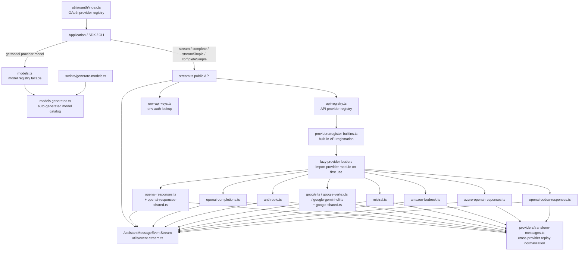
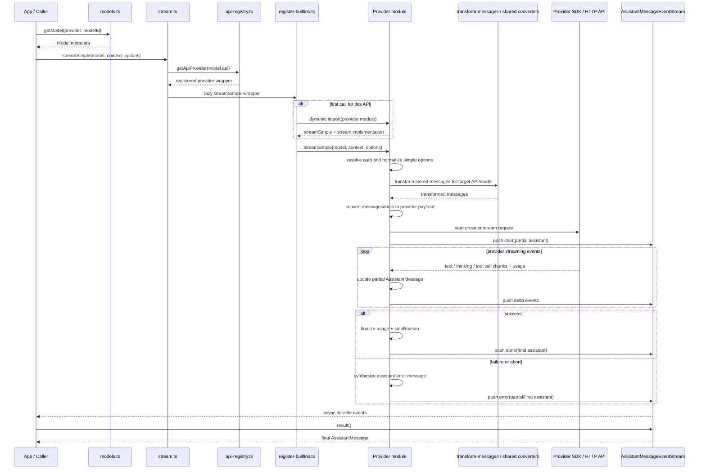
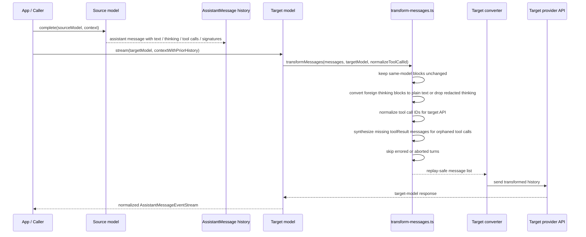
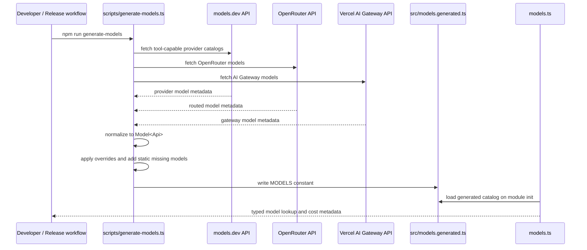

# pi-ai architecture design

This document describes how `packages/ai` (`@mariozechner/pi-ai`) works and how it is implemented.

Source basis:
- `packages/ai/src/index.ts`
- `packages/ai/src/types.ts`
- `packages/ai/src/stream.ts`
- `packages/ai/src/api-registry.ts`
- `packages/ai/src/models.ts`
- `packages/ai/src/env-api-keys.ts`
- `packages/ai/src/providers/register-builtins.ts`
- `packages/ai/src/providers/simple-options.ts`
- `packages/ai/src/providers/transform-messages.ts`
- `packages/ai/src/providers/openai-responses-shared.ts`
- `packages/ai/src/providers/openai-responses.ts`
- `packages/ai/src/providers/openai-completions.ts`
- `packages/ai/src/providers/anthropic.ts`
- `packages/ai/src/providers/google-shared.ts`
- `packages/ai/src/providers/google.ts`
- `packages/ai/src/utils/event-stream.ts`
- `packages/ai/src/utils/overflow.ts`
- `packages/ai/src/utils/validation.ts`
- `packages/ai/src/utils/oauth/index.ts`
- `packages/ai/scripts/generate-models.ts`

## 1. Purpose

`pi-ai` is the model and provider abstraction layer for the monorepo.

Its responsibilities are:
- expose a unified message and tool model across providers
- provide typed model lookup and metadata
- route requests to the correct API implementation
- normalize streaming output into one event protocol
- convert provider-specific payloads into a common `AssistantMessage`
- support reasoning/thinking in a provider-neutral way via `streamSimple()` and `completeSimple()`
- preserve context across providers and models when possible
- handle environment-based auth and OAuth provider integration
- maintain a generated catalog of tool-capable models and pricing metadata

Conceptually, `pi-ai` sits below `pi-agent-core` and above raw provider SDKs.

## 2. High-level architecture

### 2.1 Major layers

#### Public API layer
The public package surface is assembled in `src/index.ts` and `src/stream.ts`.

Main entry points:
- `getModel()`, `getModels()`, `getProviders()` from `models.ts`
- `stream()` / `complete()` for provider-specific options
- `streamSimple()` / `completeSimple()` for unified reasoning options
- registries and utilities such as `registerApiProvider()`, `getEnvApiKey()`, `validateToolCall()`, and OAuth helpers

This layer is intentionally thin. Most orchestration happens in the provider registry and provider modules.

#### Model catalog layer
`models.ts` loads `MODELS` from `models.generated.ts` at module initialization and exposes typed lookup helpers.

Responsibilities:
- typed provider/model lookup
- cost calculation through `calculateCost()`
- capability queries such as `supportsXhigh()`
- equality helpers like `modelsAreEqual()`

This is a metadata registry, not a runtime transport layer.

#### API provider registry
`api-registry.ts` maps an `api` identifier like `"anthropic-messages"` or `"openai-responses"` to an implementation with:
- `stream()`
- `streamSimple()`

Responsibilities:
- register API implementations
- type-check model/API matches at runtime
- allow custom providers or overrides
- decouple public API selection from implementation modules

The core dispatch boundary is:

```text
Model.api -> api-registry -> provider implementation
```

#### Built-in provider registration and lazy loading
`providers/register-builtins.ts` registers built-in APIs on module load.

Important design choice:
- provider implementations are loaded lazily with dynamic imports
- the registry exports wrappers immediately
- the real implementation is imported only on first use of that API

This keeps startup lighter and avoids eagerly loading every SDK.

The built-in APIs registered here are:
- `anthropic-messages`
- `openai-completions`
- `mistral-conversations`
- `openai-responses`
- `azure-openai-responses`
- `openai-codex-responses`
- `google-generative-ai`
- `google-gemini-cli`
- `google-vertex`
- `bedrock-converse-stream`

#### Provider implementation layer
Each provider module is responsible for:
- auth resolution
- payload building
- message/tool conversion
- streaming request execution
- parsing provider events into the unified event protocol
- constructing the final `AssistantMessage`

Provider families reuse shared helpers where useful:
- `openai-responses-shared.ts` is shared by OpenAI Responses, Azure OpenAI Responses, and OpenAI Codex Responses
- `google-shared.ts` is shared by Google Generative AI, Google Gemini CLI, and Google Vertex
- `transform-messages.ts` is used by multiple providers for replay and cross-provider handoff normalization
- `simple-options.ts` converts unified reasoning options into provider-specific options

#### Event stream layer
`utils/event-stream.ts` defines `EventStream<T, R>` and `AssistantMessageEventStream`.

This is the common streaming contract returned by every provider implementation.

The contract is:
- emit `start`
- emit zero or more delta events
- finish with either `done` or `error`
- allow async iteration and `result()` retrieval of the terminal `AssistantMessage`

This makes all providers look identical to callers.

#### Auth layer
Authentication is split into two paths.

Environment-based auth:
- `env-api-keys.ts` resolves provider-specific environment variables
- also handles special pseudo-values like `"<authenticated>"` for ADC or AWS credential chains

OAuth auth:
- `utils/oauth/index.ts` hosts an OAuth provider registry
- providers expose `login()`, `refreshToken()`, and `getApiKey()`
- built-ins include Anthropic, GitHub Copilot, Google Gemini CLI, Antigravity, and OpenAI Codex

#### Build-time model generation layer
`scripts/generate-models.ts` is the build-time metadata pipeline.

Responsibilities:
- fetch model catalogs from models.dev, OpenRouter, and Vercel AI Gateway
- normalize all entries into the internal `Model<Api>` shape
- apply overrides and hand-maintained additions
- duplicate or derive provider variants where needed, such as Azure from OpenAI models
- write deterministic output to `src/models.generated.ts`

This keeps runtime model lookup simple and static.

## 3. Key data structures

### 3.1 `Model<TApi>`
A `Model` describes:
- `id`, `name`
- `api`, `provider`, `baseUrl`
- `reasoning` capability
- input modalities
- cost metadata
- `contextWindow`, `maxTokens`
- optional provider headers
- optional OpenAI compatibility overrides

The important design choice is that `api` and `provider` are separate.

Examples:
- multiple providers can share `openai-completions`
- multiple providers can share `anthropic-messages`
- the same provider family can route different models to different APIs

### 3.2 `Context`
`Context` contains:
- optional `systemPrompt`
- `messages`
- optional `tools`

This is the unified provider-independent input format.

### 3.3 `Message`
The shared message union is:
- `UserMessage`
- `AssistantMessage`
- `ToolResultMessage`

`AssistantMessage` is the most important normalization target. It captures:
- content blocks (`text`, `thinking`, `toolCall`)
- provider and model identity
- usage and cost
- stop reason
- optional error message
- optional upstream response ID

### 3.4 `AssistantMessageEvent`
Providers all emit the same event protocol:
- `start`
- `text_start`, `text_delta`, `text_end`
- `thinking_start`, `thinking_delta`, `thinking_end`
- `toolcall_start`, `toolcall_delta`, `toolcall_end`
- terminal `done` or `error`

This event protocol is the main runtime abstraction of the package.

## 4. Core request flow

### 4.1 `stream()` path
1. caller resolves a `Model`
2. caller invokes `stream(model, context, options)`
3. `stream.ts` looks up the provider implementation by `model.api`
4. `api-registry.ts` returns the registered wrapper
5. if needed, `register-builtins.ts` lazy-loads the real provider module
6. provider resolves auth and builds provider-specific request params
7. provider converts unified messages/tools into provider payloads
8. provider starts the upstream streaming request
9. provider translates upstream events into `AssistantMessageEvent`s
10. provider finalizes `usage`, `stopReason`, and `responseId`
11. stream terminates with `done` or `error`

### 4.2 `complete()` path
`complete()` is just:
- call `stream()`
- await `result()` on the returned `AssistantMessageEventStream`

### 4.3 `streamSimple()` path
`streamSimple()` exists so callers can use one unified reasoning interface.

The pattern is:
- resolve auth early
- use `buildBaseOptions()` from `simple-options.ts`
- translate `reasoning` into provider-specific parameters
- delegate to provider `stream()`

Examples from inspected providers:
- OpenAI Responses maps `reasoning` to `reasoningEffort`
- OpenAI Completions maps `reasoning` to `reasoning_effort` or other compat variants
- Anthropic maps `reasoning` to adaptive effort or token budgets depending on model family
- Google maps `reasoning` to either `thinkingLevel` or token budget depending on model family

This keeps the public API simple while preserving provider-specific tuning internally.

## 5. Provider implementation pattern

Despite provider differences, the inspected provider modules share a clear template.

### 5.1 Step 1: create partial output message
Each provider constructs an initial `AssistantMessage` with:
- empty `content`
- zeroed `usage`
- provider/model metadata
- provisional `stopReason: "stop"`

This partial object is mutated during streaming and reused in emitted events.

### 5.2 Step 2: resolve auth and client
Providers use one or more of:
- explicit `options.apiKey`
- `getEnvApiKey(model.provider)`
- provider-specific client construction
- special header injection based on provider or message content

Examples from inspected code:
- OpenAI-family providers build `OpenAI` clients with merged model headers and per-request headers
- Anthropic switches between API key auth, OAuth bearer auth, and injected clients
- GitHub Copilot requests add dynamic Copilot headers
- Google uses `GoogleGenAI`

### 5.3 Step 3: convert unified context to provider payload
Each provider maps the shared `Context` into its target request shape.

This includes:
- system prompt handling
- user content conversion
- assistant replay conversion
- tool schema conversion
- tool result conversion
- filtering unsupported images when the model lacks image input

This is the main compatibility boundary in the package.

### 5.4 Step 4: stream and parse provider events
Each provider starts the upstream streaming request and incrementally updates the partial `AssistantMessage`.

Typical responsibilities:
- open new text/thinking/toolcall blocks
- append deltas
- parse partial tool JSON progressively
- emit matching start/delta/end events
- keep usage counters updated when available
- map provider stop reasons into the shared `StopReason`

### 5.5 Step 5: finalize success or synthesize error
On success:
- usage is finalized
- cost is calculated
- terminal `done` is emitted

On failure:
- partial internal-only fields are cleaned up
- `stopReason` becomes `"error"` or `"aborted"`
- `errorMessage` is attached
- terminal `error` is emitted

One important design rule is documented in `types.ts`:
- provider failures should be encoded into the returned event stream rather than thrown after stream creation

## 6. Cross-provider handoff and replay design

One of the strongest architectural features is `providers/transform-messages.ts`.

Its job is to make previously stored assistant turns replay-safe for a new target model.

Responsibilities:
- preserve same-model assistant messages as-is when replay is safe
- convert foreign `thinking` blocks into plain text or drop opaque redacted thinking
- normalize tool call IDs to target provider limits and formats
- remove provider-specific thought signatures that are invalid for the target model
- synthesize placeholder tool results for orphaned tool calls
- skip errored or aborted assistant turns entirely

This matters because providers have incompatible replay rules:
- some require strict tool call ID formats and length limits
- some retain opaque reasoning signatures that only the originating model can understand
- some break if a tool call exists without a following tool result
- replaying partial errored turns can cause downstream validation failures

The design here is not just message conversion. It is replay sanitization.

## 7. Shared provider-family abstractions

### 7.1 OpenAI Responses family
`openai-responses-shared.ts` centralizes:
- message conversion to Responses input items
- tool conversion
- streaming event processing
- stop-reason mapping

This shared module is reused by:
- `openai-responses.ts`
- `azure-openai-responses.ts`
- `openai-codex-responses.ts`

So the architecture separates:
- common Responses semantics
- endpoint-specific transport/auth/request-body differences

### 7.2 OpenAI Completions compatibility layer
`openai-completions.ts` is the compatibility-heavy provider.

It handles many OpenAI-compatible variants through `Model.compat` and URL-based assumptions.

Examples of compatibility features in the inspected code:
- `developer` vs `system` role support
- different max-token field names
- support for `store`
- support for `reasoning_effort`
- alternate reasoning formats such as OpenRouter, z.ai, and Qwen variants
- tool result naming requirements
- cases where thinking must be flattened to text
- image handling around tool results

Architecturally, this provider is the normalization layer for many third-party OpenAI-like endpoints.

### 7.3 Google family
`google-shared.ts` centralizes:
- message conversion to Gemini `Content[]`
- thought signature handling
- tool declaration conversion
- stop-reason mapping

This is reused by:
- `google.ts`
- `google-vertex.ts`
- `google-gemini-cli.ts`

So the Google family architecture mirrors the OpenAI Responses family architecture:
- shared semantic conversion
- separate transport/auth modules

## 8. Auth architecture

### 8.1 Environment-based auth
`env-api-keys.ts` is more than a static env var map.

It also encodes provider-specific auth discovery rules:
- Anthropic prefers `ANTHROPIC_OAUTH_TOKEN` over `ANTHROPIC_API_KEY`
- GitHub Copilot checks multiple GitHub token env vars
- Vertex can resolve as authenticated through ADC + project + location
- Bedrock can resolve as authenticated through AWS credential chains

This allows higher layers to ask a simple question:

```text
Do we have credentials for this provider?
```

without knowing each provider's auth mechanism.

### 8.2 OAuth registry
`utils/oauth/index.ts` contains a second registry pattern, parallel to the API provider registry.

Responsibilities:
- expose built-in OAuth providers
- allow registration or override of OAuth providers
- centralize login and refresh flow access
- provide `getOAuthApiKey()` which refreshes expired credentials before use

This keeps OAuth concerns separate from request streaming.

## 9. Model catalog generation design

The model system is intentionally split into build-time and runtime phases.

### 9.1 Build-time phase
`generate-models.ts`:
- fetches source catalogs from external APIs
- filters for tool-capable models
- maps source-specific metadata into the unified `Model<Api>` shape
- applies compatibility metadata and manual overrides
- injects hand-maintained models that are missing upstream
- derives Azure OpenAI Responses models from OpenAI Responses entries
- groups and deduplicates by provider and model ID
- writes deterministic TypeScript to `models.generated.ts`

### 9.2 Runtime phase
`models.ts`:
- loads the generated catalog into a map
- exposes typed lookup and cost helpers
- avoids network access entirely

This design gives the package:
- static runtime behavior
- no runtime dependency on catalog services
- type-safe provider/model lookup
- a single place to encode provider quirks in model metadata

## 10. Error and overflow handling

### 10.1 Stream failure model
Each provider is expected to finish the stream with a final assistant error message rather than relying on uncaught exceptions at the call site.

This keeps consumption consistent for callers using:
- `for await ... of stream`
- `await stream.result()`

### 10.2 Overflow detection utility
`utils/overflow.ts` provides a cross-provider heuristic for context overflow detection.

It combines:
- provider-specific regex matching over `errorMessage`
- special-case handling for providers like Cerebras
- optional silent-overflow detection based on `usage.input > contextWindow`

This utility is intentionally separate from providers because overflow handling is a higher-level concern shared across them.

### 10.3 Tool validation utility
`utils/validation.ts` validates tool calls against TypeBox schemas using AJV when runtime code generation is available.

Architecturally, validation is not built into providers directly. Instead, it is a shared utility that higher layers such as `pi-agent-core` can invoke.

## 11. Architectural strengths

### Separation of concerns
- public API is thin
- model metadata is static and typed
- API dispatch is registry-based
- provider transport/parsing is isolated per API
- OAuth and env auth are separate concerns

### Strong reuse across provider families
- shared Responses helpers
- shared Google helpers
- shared replay transformation
- shared simple reasoning option mapping

### Stable streaming contract
All providers normalize into the same event stream protocol and final `AssistantMessage` shape.

### Replay-aware message model
The package does not just send messages forward. It also takes replay correctness seriously, especially around reasoning blocks and tool call continuity.

### Extensibility
Custom APIs can be added through `registerApiProvider()`, and custom OAuth providers through `registerOAuthProvider()`.

## 12. Mermaid diagrams

### 12.1 Architecture overview



### 12.2 Sequence: normal stream request



### 12.3 Sequence: cross-provider handoff



### 12.4 Sequence: model generation



## 13. Summary

In implementation terms, `pi-ai` is a registry-driven streaming abstraction over many heterogeneous LLM APIs.

It combines:
- a generated static model catalog
- runtime API dispatch by `model.api`
- lazy-loaded provider implementations
- replay-safe message transformation
- one normalized streaming event protocol
- pluggable auth through env vars and OAuth registries

That combination is what allows higher-level packages to treat Anthropic, OpenAI, Google, Bedrock, Copilot, and other providers as one coherent system without giving up provider-specific capabilities.
